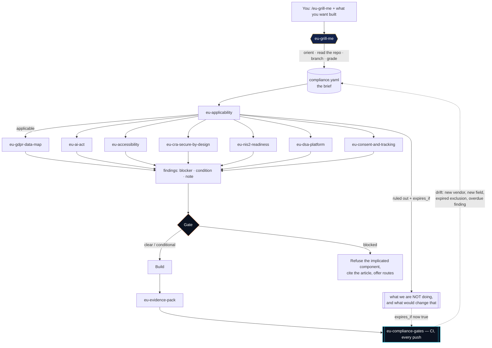

<div align="center">


# 🇪🇺 eu-compliance-skills

**A library of IDE skills that interrogate you before they build.**

Most compliance tooling audits software after it exists, which is the expensive
end. These skills run at the other end: your agent asks the questions that decide
lawfulness, refuses vague answers, records what you could not answer — and
**gates the build** on what comes back.

The main skill is [`eu-grill-me`](#the-grill). Everything else consumes what it
produces.

[](LICENSE)
[](#the-skills)
[](#install)
[](#install)
[](#contributing)

*Third in a series with [agent-harness-skills](https://github.com/ArttuAn/agent-harness-skills)
(the loop) and [agent-memory-skills](https://github.com/ArttuAn/agent-memory-skills)
(what the loop remembers).*

</div>

> ### Not legal advice
>
> These skills produce **questions, findings, documentation and code**. They do
> not produce legal opinions, and nothing here substitutes for a qualified lawyer
> or a Data Protection Officer. Their highest-value output is a brief that makes
> an hour of a lawyer's time worth ten.

> ### Grounded in primary law
>
> Every obligation a skill states maps to a concrete article of a named
> Regulation or Directive, and every instrument is linked to its consolidated
> text on EUR-Lex — [the full table is below](#primary-legal-sources). A claim
> whose citation cannot be clicked through to a source is treated as a
> fabrication, and CI rejects it before it reaches anyone.

## The grill

You ask for a product. Before writing it, the agent finds out what it actually
is — in the unflattering detail regulation turns on — and does not build the
gated parts until the deciding facts are on the record.

```text
/eu-grill-me build me a SaaS that ranks inbound job applicants
```

```text
> Four questions first.
>
> 1. In one paragraph, what does it do and who uses it? Mechanics, not the pitch.
> 2. Are any users, customers or data subjects physically in the EU/EEA?
>    Applicants and employees count.
> 3. Does anything use ML, an LLM, or an automated rule that decides something
>    about a person?
> 4. Do you host it, ship it, or put it in a device?

...

> A-06 — How long do you keep each category, and what deletes it?
< "as long as we need it, standard stuff"

> That's not a retention period I can record. Narrower: for applicant CVs
> specifically — how many days, and what job or process deletes them? I'm asking
> because Art. 5(1)(e) needs a number and a mechanism, and if there isn't one
> that's a finding rather than a blocker.
< "180 days, there's a cron in jobs/purge_applicants.py"

> Recorded. A-07 — show me the deletion path. All of it: primary tables, backups,
> logs, search index, analytics vendor, CRM.
```

And at the end, a gate that is specific about what it will and will not do:

```text
> Gate: BLOCKED (1 blocker, 2 conditions, 1 open unknown)
>
> I can build the application intake, the storage layer and the recruiter
> dashboard now.
>
> I'm not going to build the ranking model yet. F-001: the historical CVs you
> want to train on have no identified lawful basis (Art. 6 GDPR), and training is
> a separate purpose from the ranking you already assessed. That isn't a
> documentation gap I can paper over in code — there's no version of the training
> step that's lawful without it.
>
> Two ways forward: (a) Priya identifies and documents a basis — if it's
> legitimate interests it needs a balancing test, and applicants' reasonable
> expectations are the hard part; or (b) we descope to ranking on the fields
> applicants submit for this role, which is a different and much easier question.
> Say which and I'll keep going.
```

Three properties make that a gate rather than a form:

| | |
| --- | --- |
| **`UNKNOWN` passes. `VAGUE` does not.** | "We don't know where our vendor hosts, Sam is checking by the 22nd" is an honest artifact a regulator can read. "Standard vendors, should be fine" is a liability written in the voice of diligence. |
| **It refuses the component, not the task.** | An agent that refuses to build the signup form because the ranker has a problem gets uninstalled that afternoon. |
| **The escape hatch produces a better artifact than skipping it.** | `accept F-001 --by "Dana Ruiz, CTO" --review-by 2026-11-01 --rationale "..."` — a named human, a reason, a review date. Recorded in the brief, re-raised by CI when the date passes. |

## How it fits together



The loop at the bottom is the part most compliance work is missing. A brief is
true on the day it is written; `eu-compliance-gates` is what keeps it true, by
failing the pull request that adds a vendor with no DPA or a field the data map
does not mention.

## The skills

| Skill | Claude command | What it does |
| --- | --- | --- |
|  **`eu-grill-me`** | `/eu-grill-me` | **The gate.** Adaptive interrogation, answer grading, findings, and a refusal that names the component |
| 🗺️ `eu-applicability` | `/eu-applicability` | Which regimes apply — and the ruled-out list with the fact that decides each and the condition that revives it |
| 🔐 `eu-gdpr-data-map` | `/eu-gdpr-data-map` | Field → purpose → basis → retention → deletion path; the Art. 30 record; an erasure test that runs in CI |
| 🤖 `eu-ai-act` | `/eu-ai-act` | Prohibited first, then role (Art. 25 is the trap), then tier, then duties |
| ♿ `eu-accessibility` | `/eu-accessibility` | EAA + EN 301 549 as numbered, testable acceptance criteria, honest about what tooling cannot check |
| 🛡️ `eu-cra-secure-by-design` | `/eu-cra-secure-by-design` | SBOM from the build, vulnerability handling, support period, the 24-hour reporting path |
| 🏛️ `eu-nis2-readiness` | `/eu-nis2-readiness` | Entity scope under national law, the ten Art. 21(2) measures, board accountability |
| 💬 `eu-dsa-platform` | `/eu-dsa-platform` | Which layer you are; notice-and-action, statements of reasons, ad and recommender constraints in code |
| 🍪 `eu-consent-and-tracking` | `/eu-consent-and-tracking` | Everything that touches the device, and gating that actually gates |
| 🚨 `eu-incident-response` | `/eu-incident-response` | One incident, several clocks — 24h, 72h and one month, computed from separate awareness timestamps |
| 📁 `eu-evidence-pack` | `/eu-evidence-pack` | What a regulator, auditor or acquirer asks for — generated where possible, placeholders counted |
| 🔁 `eu-compliance-gates` | `/eu-compliance-gates` | CI checks that fail when the code drifts away from the record |

## What makes these different from a checklist

**They ask about the system, not about the law.** Asked "what is your lawful
basis?", a builder gives a wrong answer confidently. Asked "if a user told you to
stop this tomorrow, what would break?", they give an accurate one, and the skill
does the mapping.

| Never ask | Ask |
| --- | --- |
| "Do you process personal data?" | "List every field you store about a person, including IDs, IPs and logs." |
| "Is this a high-risk AI system?" | "What decision does the output change, and what happens to the person if it's wrong?" |
| "Do you have consent for cookies?" | "List everything that writes to the browser before the user clicks anything." |
| "Are you accessible?" | "Can the primary task be done keyboard-only, at 200% zoom, with a screen reader?" |
| "Is there human oversight?" | "In the last hundred cases, how often did the human go against it — and did they see anything it didn't?" |

**They refuse to state legal conclusions.** "This is not high-risk" is not an
agent's to say. Findings carry the facts, the citation and the open question, and
name what specifically needs a lawyer:

> **F-004 · condition · AI Act** — The system ranks job applicants (answer to
> Q-12). Annex III(4)(a) covers AI systems intended for recruitment or selection.
> **If** confirmed, Chapter III obligations follow. *Classification must be
> confirmed by counsel before build.*

**They treat a fabricated citation as the top risk.** An agent writing fluent
legal register that cites an article which does not exist is worse than silence,
because it converts a question into a settled point. `tools/check_citations.py`
runs in CI: article numbers are bounds-checked per instrument, recitals may not
be cited as requirements, and legal conclusions are rejected outside quoted
counterexamples. **CI also plants a fabricated citation and fails if the checker
does not catch it.**

**They are honest about the model's cutoff.** EU timelines move — several were
being amended while this was written. Dates are never asserted from memory; they
carry a citation and an instruction to verify against EUR-Lex.

## Primary legal sources

Every rule in `skills/` was written against the consolidated text of the
instrument it cites, not against a summary of it. This is the map: each row is
what the repo means when it writes `Art. N <instrument>`, and the link is where
you click to read the actual obligation.

| Instrument | Number | EUR-Lex — consolidated text | Grounds |
| --- | --- | --- | --- |
| **GDPR** | Regulation (EU) 2016/679 | [CELEX 32016R0679](https://eur-lex.europa.eu/legal-content/EN/TXT/?uri=CELEX:32016R0679) | `eu-gdpr-data-map` — lawful basis, the Art. 30 record, retention and deletion; the spine every other skill runs on |
| **AI Act** | Regulation (EU) 2024/1689 | [CELEX 32024R1689](https://eur-lex.europa.eu/legal-content/EN/TXT/?uri=CELEX:32024R1689) | `eu-ai-act` — Art. 5 prohibitions, provider/deployer role, Annex III tier, Chapter III duties |
| **DSA** | Regulation (EU) 2022/2065 | [CELEX 32022R2065](https://eur-lex.europa.eu/legal-content/EN/TXT/?uri=CELEX:32022R2065) | `eu-dsa-platform` — hosting layer, notice-and-action, ad and recommender constraints |
| **CRA** | Regulation (EU) 2024/2847 | [CELEX 32024R2847](https://eur-lex.europa.eu/legal-content/EN/TXT/?uri=CELEX:32024R2847) | `eu-cra-secure-by-design` — SBOM, vulnerability handling, support period, reporting |
| **NIS2** | Directive (EU) 2022/2555 | [CELEX 32022L2555](https://eur-lex.europa.eu/legal-content/EN/TXT/?uri=CELEX:32022L2555) | `eu-nis2-readiness`, `eu-incident-response` — the ten Art. 21(2) measures and the 24h/72h/1mo clocks |
| **ePrivacy** | Directive 2002/58/EC | [CELEX 32002L0058](https://eur-lex.europa.eu/legal-content/EN/TXT/?uri=CELEX:32002L0058) | `eu-consent-and-tracking` — anything written to or read from the device |
| **EAA** | Directive (EU) 2019/882 | [CELEX 32019L0882](https://eur-lex.europa.eu/legal-content/EN/TXT/?uri=CELEX:32019L0882) | `eu-accessibility` — with EN 301 549 v3.2.1 as the harmonised standard |
| **Data Act** | Regulation (EU) 2023/2854 | [CELEX 32023R2854](https://eur-lex.europa.eu/legal-content/EN/TXT/?uri=CELEX:32023R2854) | connected-product and cloud data-sharing obligations |
| **DORA** | Regulation (EU) 2022/2554 | [CELEX 32022R2554](https://eur-lex.europa.eu/legal-content/EN/TXT/?uri=CELEX:32022R2554) | ICT risk for regulated financial entities and their critical third parties |
| **PLD** | Directive (EU) 2024/2853 | [CELEX 32024L2853](https://eur-lex.europa.eu/legal-content/EN/TXT/?uri=CELEX:32024L2853) | defective-software product liability |
| **MDR** | Regulation (EU) 2017/745 | [CELEX 32017R0745](https://eur-lex.europa.eu/legal-content/EN/TXT/?uri=CELEX:32017R0745) | software with a medical purpose |
| **eIDAS 2** | Regulation (EU) 2024/1183 | [CELEX 32024R1183](https://eur-lex.europa.eu/legal-content/EN/TXT/?uri=CELEX:32024R1183) | EU Digital Identity Wallet acceptance and issuance |

Why the links matter: **pointing at the source is how a citation earns its
authority.** `tools/check_citations.py` verifies mechanically that no `Art. N`
exceeds the real last article of its act, that no recital is cited as a
requirement, and that no legal conclusion is stated — but it cannot confirm that
an article says what a finding claims. Only a human can, which is why every
finding in a brief carries the same three parts: **the fact** (from an answer or
the code), **the citation** (to a row above), and **the open question** (what a
lawyer must confirm). Nothing here is an assertion of its own authority; every
rule traces back to a source you can open.

Four Directives in the table — NIS2, ePrivacy, EAA and PLD — bind through
**national transposition**, which differs by Member State and has run late for
NIS2. The regex skills cite the EU article and add *"as transposed in
\<Member State\>"*; the national law, not this table, is the binding text.

## Install

```bash
git clone https://github.com/ArttuAn/eu-compliance-skills.git
cd eu-compliance-skills
./install.sh                          # global: ~/.config/opencode/skills + ~/.claude/commands
./install.sh --project                # or local: .opencode/skills + .claude/commands
```

Skills land in your opencode config with the shared `references/` and `schema/`
copied alongside each one; commands land in your Claude Code config.

Then, in any project: `/eu-grill-me <what you want built>`.

## The brief

One artifact, two renderings: `compliance.yaml` (machine-readable, the spine) and
`COMPLIANCE-BRIEF.md` (generated — never hand-edited, so the two cannot disagree).

```yaml
findings:
  - id: F-001
    severity: blocker
    regime: gdpr
    citation: "Art. 6(1)"
    question: A-11
    statement: >
      No lawful basis identified for using historical applicant CVs as training
      data. The basis given for ranking was not assessed for the training
      purpose, which is a separate purpose.
    needs: "A documented basis per purpose, and an LIA if relying on Art. 6(1)(f)."
    owner: "Priya"
    due: "2026-10-01"
    status: open

regimes:
  ruled_out:
    - regime: nis2
      reason: "below the size cap in every Member State of establishment"
      deciding_fact: "E-01: 28 staff, EUR 4.2M turnover"
      confirmed_by: "counsel, 2026-09-10"
      expires_if: "headcount >= 50 or turnover_eur > 10000000"
```

Four rules the [schema](schema/compliance.schema.json) enforces:

- **Every claim carries a `source`** — `{kind: answered, question: A-07}` or
  `{kind: inferred, reasoning: "..."}`. A brief with untraceable claims is a
  fabrication wearing the clothes of a compliance record.
- **`status` is derived, never typed.** If a human can set `clear` by editing the
  file, the gate is decorative.
- **Findings are append-only.** Resolving sets `status: resolved`; the row
  survives. The history *is* the accountability record (Art. 5(2) GDPR).
- **Every exclusion carries `expires_if`.** "Below the NIS2 size cap" stops being
  true at the 50th hire, and CI is what notices.

## The shared contracts

Five documents the skills cite rather than restate.

| Reference | What it settles |
| --- | --- |
| [`how-to-ask.md`](references/how-to-ask.md) | The interrogation method: the answer-quality rubric, re-asking without being insufferable, the answers that sound like answers |
| [`regime-map.md`](references/regime-map.md) | Every regime, its trigger, its dates, its exposure, and what is usually *not* in scope |
| [`legal-citations.md`](references/legal-citations.md) | Citation discipline, the source hierarchy, and what an agent may and may not conclude |
| [`compliance-brief.md`](references/compliance-brief.md) | The brief schema, field by field, and why each rule exists |
| [`evidence.md`](references/evidence.md) | What a regulator, auditor or acquirer actually asks for, and why it must exist before you need it |
| [`verification.md`](references/verification.md) | The three-tier contract, the metrics, and the negative controls |

## Verification

You cannot unit-test "is this GDPR compliant". You can test everything that
produces the answer — and [`verification.md`](references/verification.md) does:

- Every claim traces to an answer; inferred claims carry reasoning.
- No fabricated citations; no recital cited as a requirement; no legal conclusions.
- A scripted "standard analytics, should be fine" grades `VAGUE`, gets re-asked,
  and is never recorded.
- The gate blocks on an open blocker, and `status` cannot be hand-edited to clear.
- **Two negative controls**: `fixtures/worst-case.yaml` must be **blocked**, and
  `fixtures/static-site.yaml` must be **clear**. A gate that passes the first is
  measuring nothing; one that blocks the second gets switched off in week two.

## Anatomy of a skill

```text
skills/grill-me/
  SKILL.md                 # theory, the questions, the grading, inline code, failure modes
commands/eu-grill-me.md    # Claude Code slash-command edition
references/*.md            # shared contracts, cited by every skill
schema/compliance.schema.json
```

Every skill carries the same six sections, and CI enforces it:

`## Use this when` · `## Ask first` · `## What the law requires` ·
`## What to produce` · `## Failure modes` · `## Verify`

## Creating a new skill

1. Directory under `skills/`; skill name `eu-<directory>`; matching
   `commands/eu-<directory>.md`.
2. **`## Ask first` is mandatory.** A skill that builds without asking is the
   thing this library exists to prevent. Ask about the system; map to the law
   yourself.
3. Open with **when not to use it**, including the size exemptions and the
   "record the exclusion with `expires_if`" path.
4. Every obligation carries a citation you could point to on EUR-Lex. If you
   cannot, say so — a true statement with `[citation needed]` beats a false one.
5. Never state a date from memory. Cite it and instruct the reader to verify.
6. `## Failure modes` and `## Verify` must correspond: every failure mode worth
   naming should have a test that would catch it.
7. Carry the "Not legal advice" notice once, near the top. Once — a document that
   hedges constantly teaches the reader to skip the hedges.
8. Run `python3 tools/check_skills.py && python3 tools/check_citations.py`.

## Contributing

Corrections to citations and scope analysis are especially welcome, and so are
new regimes. Open a PR against `main`; both checkers must pass.

If you are a lawyer and something here is wrong, please open an issue — being
wrong in public and fixed quickly is the design.

## License

[MIT](LICENSE) — do anything you like, attribute politely.
